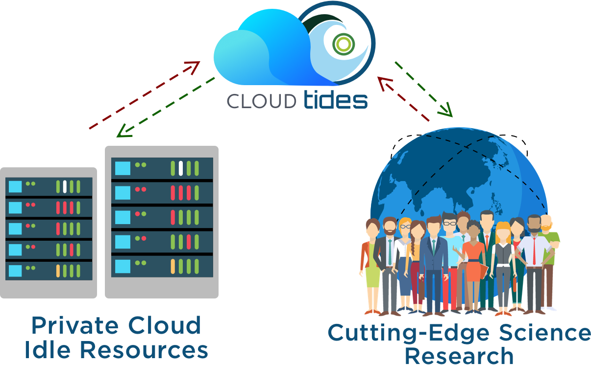

# Overview

In enterprises that have private clouds, their capacity is usually designed to meet the average or peak time usage. When usage drops, the resources are very likely to keep running but stay idle. Although those resources are running idle, they are still consuming power, cooling, space and operational labor to maintain them. These costs are wasted. Considering the huge number of companies (with private cloud) in the world, the idle resources and the waste are huge.

On the other side, there are many organizations in the world that need computing resources, for example, many non-profitable organizations (NPO) and science research organizations. They may not have enough budget to purchase all of the required capacity or the procurement and installation may take a long time to complete. Therefore, they have a strong need to leverage the existing resources in the world. We would like to propose this project to bridge the requirements of such organizations with the idle resources in the enterprises.

    

Refer to [CloudTides](https://github.com/scienterprise/CloudTides/wiki/CloudTides----Elastic-Platform-on-Idle-Cloud-Resources) for details.