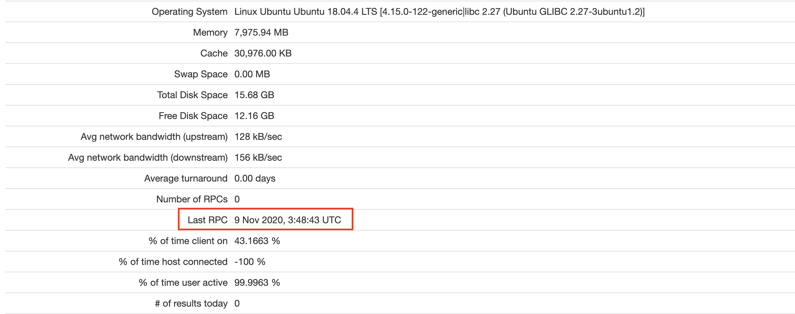

# Admin Guide

Admin's duties include user and resource management on CloudTides, host check on Scienterprise.

## User Registration

Current version of CloudTides only allows admin to register users. To create a new user:
- Open [CloudTides](http://www.cloudtides.org.cn) website in browser.
- Login with your admin account.
- If login is successful, click the profile icon on top-right corner, a navigation bar will be popped up.
- Click "Sign up", you will be navigated to registration page. Fill in the form and click "Register". A new user is created.

All users created by admin has lowest privilege on CloudTides, i.e. they can only view and update their own resources.

Future improvements:
- Admin should be able to manage users' privileges

## Resource Management

Admin takes charge of resource activation for all user-registered resources. The admin should know what happens when a user registers a new resource, refer to [resource initialization](server/components.md#resource-initialization). During resource initialization, the admin performs following actions:
- Open [Scienterprise admin page](http://boinc.scienterprise.cn/ops/) in browser. Click "Hosts" in "Browse database" column.
- Query the hosts. If needed, enter some additional clauses like user id, etc. Click "OK".
- For queried hosts, click ID on leftmost column, host details will be shown.
- Look at "Last RPC" field, check whether the host recently communicates with Scienterprise server. Note that the RPC time is in UTC time, there is an 8 hour time difference.
- If there is such a host, click "Activate" button on CloudTides resource card. The resource is ready to contribute.

  
Future improvements:
- Manually looking up hosts is inconvenient and human error may occur. If Boinc provides API for querying information about hosts, this part can be integrated into CloudTides server.
- Scienterprise time is aligned to UTC, better to adjust to Beijing time.
