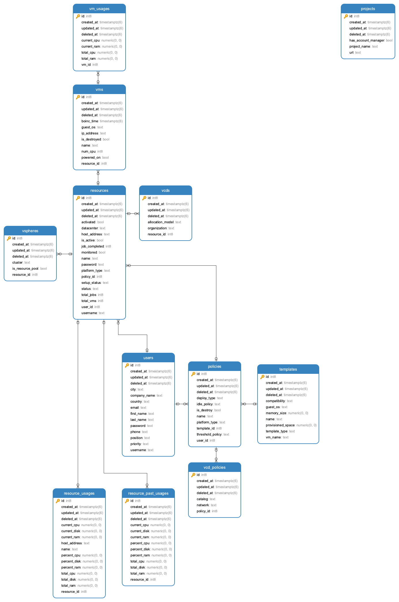

# Backend Components
## Go-swagger

The server side uses [go-swagger](https://github.com/go-swagger/go-swagger) to generate REST APIs. OpenAPI specifications can be found at [OpenAPI](https://swagger.io/specification/v2/).

To generate REST API,

```
make gen
```

will check your OpenAPI specifications and then generate corresponding code.

Generate API doc:
```
swagger serve ./swagger/swagger.yml
```

## Gorm

The server uses [gorm](https://github.com/go-gorm/gorm) to map Go structs to database schemas and interact with [PostgreSQL](https://www.postgresql.org/). The doc can be found [here](https://gorm.io/docs/). Database table schemas are defined in `./pkg/models/`.

Future improvements:
- `gorm` has a `Scan` function which is convenient for reading data into Go structs. The application code currently does not utilize it. Refer to https://gorm.io/docs/query.html.

## go-vcloud-director

The server fully supports vCloud-director resource using [go-vcd API](https://github.com/vmware/go-vcloud-director). To get familiar with this package, it is recommended:
- Log into Thinkcloud to familiarize with vcd components (allocation model, org, vapp, etc.)
- Try to manually deploy VM/VAPP, it helps with understanding essential configuration/function when writing code.
- Run demo code and explore the source code, typically what each object (org, vapp, vm) contains.

## Resource Initialization

When a resource is registered into CloudTides, a background job is initiated to check whether the resource is valid for contribution. This is called resource initialization.

Detailed workflow:
- The API handler of resource registration connects to the vcd resource with user provided information, creates a new user on resource, stores that into database.
- The API handler initiates a `goroutine`: Deploy a small VM (2 CPU, 2GB memory) from template, power on the VM.
- The Boinc client on the VM is supposed to connect to Scienterprise (attached to Scienterprise in VM template).
- The administrator looks up hosts information on Scienterprise website to check whether the VM successfully connects to Scienterprise.
- If initialization process is successful, the administrator logs in CloudTides, activates the resource. The activation triggers a `goroutine` which destroys the deployed VM.

## Controller

Controller is the key component of CloudTides. The controller is a [cronjob](https://ostechnix.com/a-beginners-guide-to-cron-jobs/) that monitors resource usage, and CRUD VMs on resources based on usage status. The controller is integrated into server, the implementation is in `./pkg/controller/`, which uses a friendly [cronjob package](https://github.com/robfig/cron).

Some important functions in controller:
- The variable `cronjobs` is a hash table with key as resource ID and value as pointer to cronjob. It stores the cronjob information for each resource that is being monitored.
- `InitController` is called when the server starts. It initializes variable `cronjobs`, starts two cronjobs: `InitJob` and `InitCleanUp`.
- `InitJob` checks any active but unmonitored resources, generates a vcd config file used for vcd connection, and starts a new cronjob `Runjob` monitoring the resource.
- `RunJob` first queries resource usage, stores usage into database. Then based on the contribution policy, update usage status as idle/normal/busy, deploy from VM template/destroy VM/suspend VM.
- `InitCleanUp` cleans up past usage table in database to avoid data overflow.

Future improvements:
- More sophosticated error checking and reporting. Current implementation simply aborts job when error occurs.
- Integrate vSphere resource.

## JWT Authentication

The server uses JWT(Json Web Token) for user authentication. Introduction to JWT is [here](http://self-issued.info/docs/draft-ietf-oauth-json-web-token.html). Golang implementation is [here](https://github.com/dgrijalva/jwt-go).

JWT claim definition:
```
type Claims struct {
	Id uint
	jwt.StandardClaims
}
```

Authentication workflow:
- When the user logs in successfully, the server responds with a token which encrypts user's ID in the database.
- The client side stores this token as long as user keeps logging status.
- Subsequent http requests made by the user has `Authorization: Bearer ${this.loginService.token}` in request headers.
- When the server receives requests, it parses the token into user ID, and check if user is valid.

Future improvements:
- The authentication function is hard-coded in each API handler function. Moving authentication into middleware is recommended.

## CORS

Introduction to CORS is [here](https://developer.mozilla.org/en-US/docs/Web/HTTP/CORS).

CORS policy is implemented in `setupGlobalMiddleware` function in `./pkg/restapi/configure_cloud_tides.go`. Set `Debug` field to `true` to view verbose CORS information.

## Logger

The server uses [logrus](https://github.com/Sirupsen/logrus) for logging. Implementation refers to https://goswagger.io/use/middleware.html.

## Database

The backend uses [PostgreSQL](https://www.postgresql.org/) for data storage.
 
Current ER diagram:



Future improvements:
- Current schema is designed only for functioning. Call for better schema design, possibly following database [normal forms](https://www.geeksforgeeks.org/boyce-codd-normal-form-bcnf/).
- For vCloud Director resource, the `vm` and `vm_usage` tables is not appropriate. Better to create `vapp` table with vapp-related fields.
