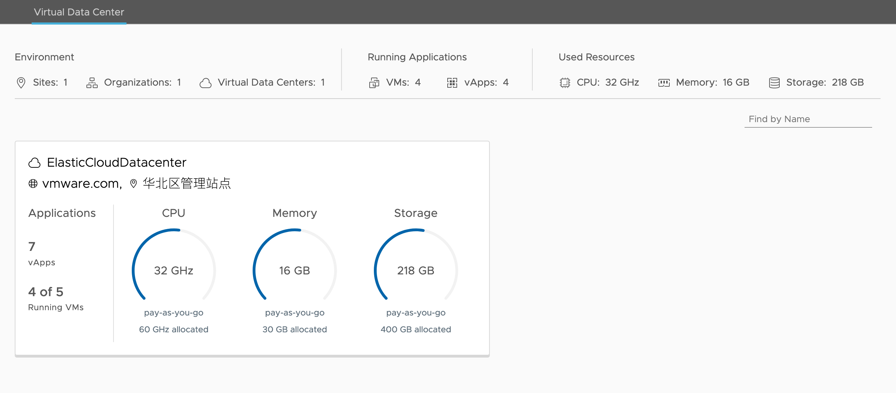

# ThinkCloud

## vCloud Director

ThinkCloud is a vCloud Director resource. Some vcd references:
- https://blog.calsoftinc.com/2017/03/vmware-vcloud-director-introduction.html
- https://blogs.vmware.com/cloudprovider/2013/02/vmware-vcenter-vs-vcloud-director.html
- http://www.yellow-bricks.com/2010/09/22/vcd-allocation-models/

## User Guide

### Datacenter Information

Users can inspect resource usage, tenant and allocation model on ThinkCloud UI.



The image shows tenant is `vmware.com`, datacenter name is `ElasticCloudDatacenter`, allocation model is `pay-as-you-go`.

### VM/VAPP CRUD

Users can also CRUD VM/VAPP on ThinkCloud. Refer to [Create a VM on ThinkCloud](https://github.com/scienterprise/ScienterpriseServer/wiki/Create-a-VM-on-ThinkCloud) for details. After creating a VM, you may setup VM environment through web console. Note that VMs are able to visit external resources, while external sources cannot connect to VMs on ThinkCloud. This guarantees data security.

A VAPP composes of one or more VMs with shared network. VAPP is the unit for template. Users can only convert VAPP (not VM) to a template. Moreover, when deploying from a template, it produces a VAPP (not VM). You may compose a new VAPP by first creating an empty VAPP, then create/move a VM inside the VAPP.

To convert a VAPP to a template, click "Actions" on VAPP card. Then click "Add To Catalog". Catalog works as a folder for storing VAPP templates. You may create new catalogs through `Libraries->Catalogs` on top tab.

To deploy a VAPP from a template, click `New->Add New vAPP From Catalog` in Applications tab. Remember to `power on and force customization` VM inside the VAPP to assign it a different IP address from the template.

To delete a VM, first click "Shut Down Guest OS", then click "Delete". To delete a VAPP, first click "Stop", then click "Delete".

### Sample VM Environment Setup

Current template is installed with Gromacs 2020.3, and boinc client attached to Scienterprise project.

For Gromacs installation, refer to [gromacs](https://github.com/scienterprise/ScienterpriseServer/wiki/Gromacs-Installation). Since ThinkCloud does not have GPU, the "quick and dirty installation" is enough.

For Boinc, run
```
apt update && apt install boinc-client
```

You now have Boinc client installed, type `boinccmd` to check available commands. In order to attach this VM to Scienterprise, first create an account on [Scienterprise](http://boinc.scienterprise.cn/), look up the account key in your profile. In VM web console, type
```
boinccmd --project_attach boinc.scienterprise.cn <account key>
```

Type `boinccmd --get_project_status` to check if connection is successful.

After these steps, this VM will be ready for receiving jobs from Scienterprise, compute them, and upload results to Scienterprise server.

## Future Improvements

- The VM web console is not user-friendly. Tools supporting copy-paste commands might be helpful.
- VAPP template has a very large size, 3.1GB. Figure out how to reduce template size.